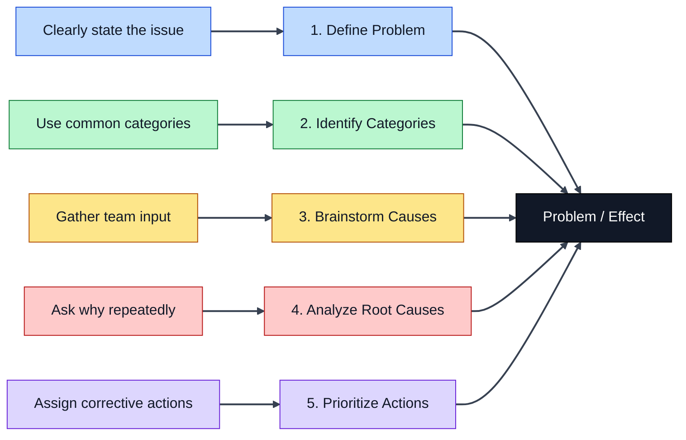

# Fishbone Diagrams

Fishbone diagrams are another tool for helping a practice identify factors that are causing obstacles or affecting performance. They are also called cause-and-effect diagrams. Practices then use this information to generate and prioritize ideas for improvement.

## Five steps to creating a fishbone diagram

1. **Create a problem statement** and write it at the "head" of the fish. This is the "effect."
2. **Define the categories** of possible causes and write them at the end of each rib. Practices can create their own or use already existing category sets like this healthcare one: people, materials, methods, measurement, environmental factors, and policies and procedures.
3. **Brainstorm "causes" under each category.**
   - Ask "Why does this happen?" to stimulate brainstorming.
   - Draw lines off of each rib and write down "causes."
   - Place causes in more than one category if appropriate.
   - Ask practice to brainstorm possible causes for each category.
4. **Use the "5 Whys" process** to analyze the most important causes further. Add additional "bones" to the fish to record these.
5. **Use the causes to generate change ideas to test.** Ask the practice:
   - "What ideas do you have to address this?"
   - "Which idea do you want to try first?"

**Tip:** If you are using a white board or flip chart, take a picture of the diagram with your phone and email it to the team for them to review.

## Diagram

